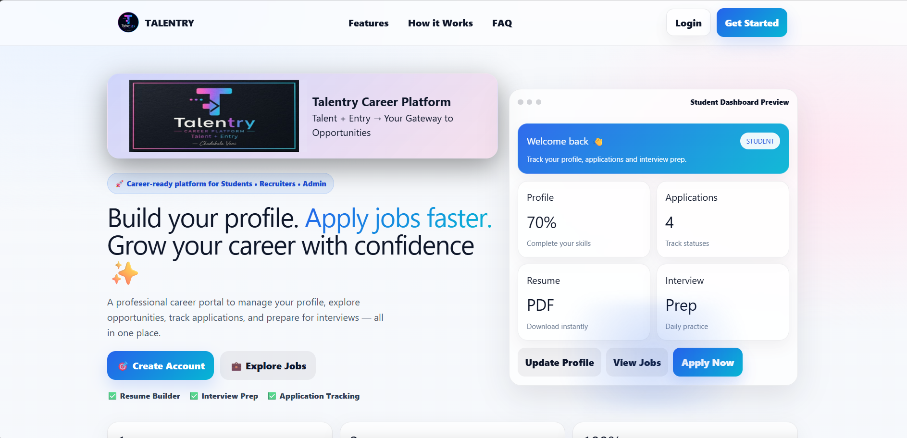
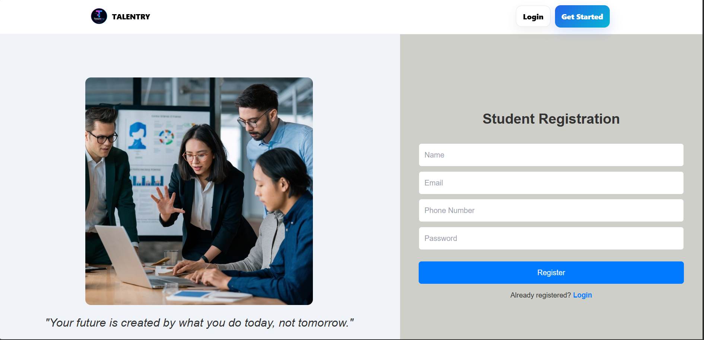
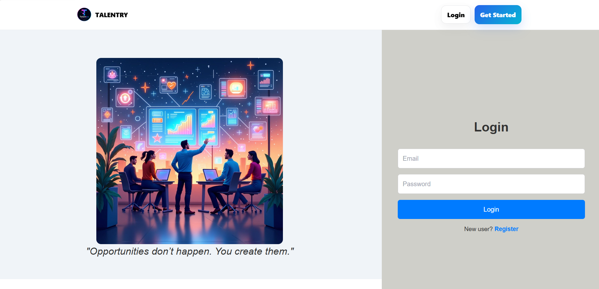
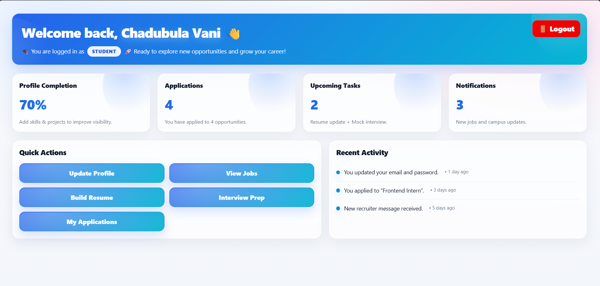
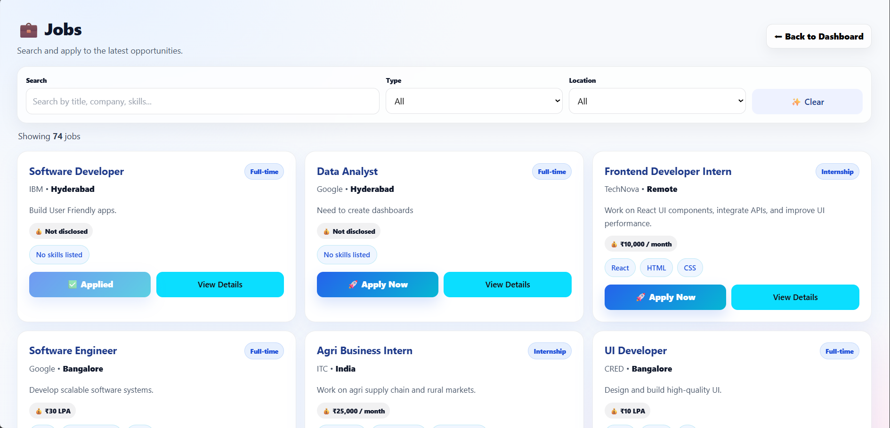
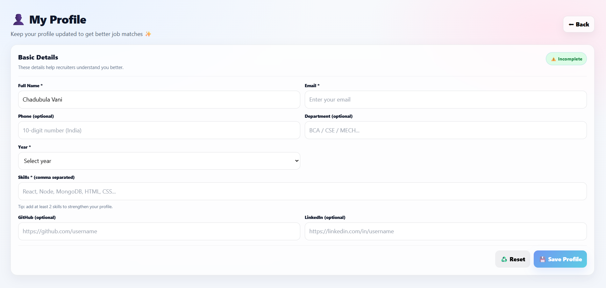
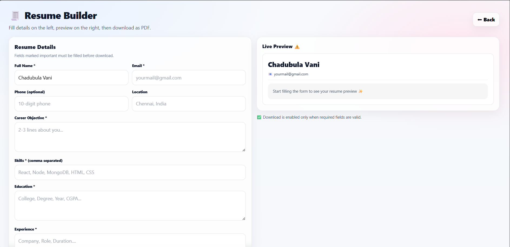
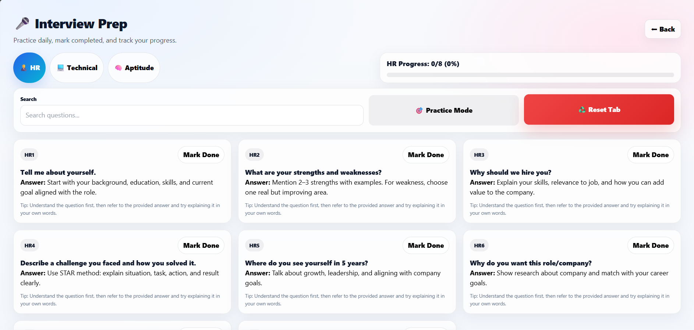
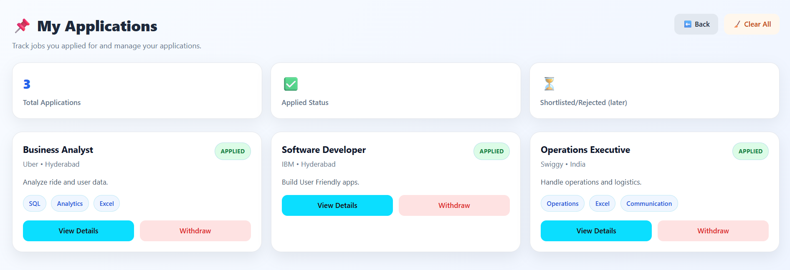
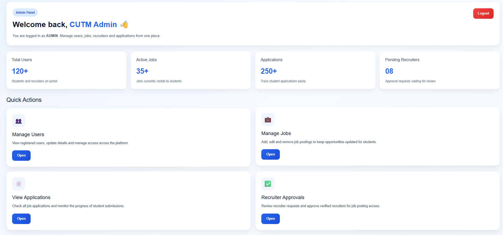

# 🚀 Talentry – Career Portal (MERN + Vite)

Talentry is a full-stack **Career Portal Web Application** built using the **MERN Stack (MongoDB, Express, React, Node.js)** with **Vite for frontend tooling**.  
It is designed to help students manage their career journey — from profile building to job applications, resume creation, and interview preparation — all in one platform.

---

## ✨ Live Features Overview

Talentry is a role-based career platform designed for:

- 🎓 Students
- 🧑‍💼 Recruiters
- 🛠️ Admins

### 🌟 Key Features

#### 👤 User Features (Student Side)
- Secure login & registration (JWT authentication)
- Smart profile creation (skills, education, links, etc.)
- Profile completion tracking system
- Job browsing and filtering
- One-click job application system
- Application tracking dashboard
- Resume builder (download as PDF)
- Interview preparation module (HR / Technical / Aptitude)

#### 🧑‍💼 Recruiter Features (will be added later)
- Post new job listings
- Manage job postings
- View applicants per job
- Track candidate applications

#### 🛠️ Admin Features
- Manage users (students & recruiters)
- Control job postings
- System monitoring and moderation

---

## 🧱 Tech Stack

### 🖥️ Frontend (Vite + React)
- React.js (UI library)
- Vite (fast build tool)
- React Router DOM (routing)
- React Toastify (notifications)
- Axios (API calls)
- Tailwind CSS (utility-first framework)
- CSS3 (custom responsive styling)

### ⚙️ Backend (Node + Express)
- Node.js
- Express.js
- MongoDB (database)
- Mongoose (ODM)
- JWT (authentication & authorization)
- Bcrypt.js (password hashing)
- dotenv (environment variables)

---

## 📁 Project Structure 

FINAL YEAR PROJECT/
│
├── cutm-career-portal/
│
├── backend/
│   ├── config/
│   ├── controllers/
│   ├── middleware/
│   ├── models/
│   ├── node_modules/
│   ├── routes/
│   ├── uploads/
│   ├── .env
│   ├── package.json
│   ├── package-lock.json
│   └── server.js
│
├── frontend/
│   ├── node_modules/
│   ├── public/
│   ├── src/
│   │   ├── assets/
│   │   ├── pages/
│   │   ├── App.css
│   │   ├── App.jsx
│   │   ├── index.css
│   │   └── main.jsx
│   │
│   ├── index.html
│   ├── package.json
│   ├── package-lock.json
│   └── postcss.config.js
│
├── .gitignore
└── README.md

---

# 📸 Project Screenshots

## 🏠 Home Page

  

---

## 🔐 Authentication

  
  

---

## 📊 Student Dashboard

  

---

## 💼 Job Portal

  

---

## 👤 Profile Page

  

---

## 🧾 Resume Builder

  

---

## 🎤 Interview Preparation

  

---

## 👩‍💻 My Applications

  

---

## 🛠️ Admin Dashboard

  

---

## 🔐 Authentication Flow
User registers / logs in
Backend generates JWT token
Token stored in frontend (localStorage)
Protected routes validate token
Role-based access controls dashboard views

## 📊 Core Modules
# 1. 🏠 Home Page (Landing Page)
Modern SaaS-style UI
Brand introduction (Talentry – Talent + Entry)
CTA buttons (Register / Login / Explore Jobs)
Feature highlights
How it works section
Testimonials and FAQ

# 2. 📂 Dashboard Module
Personalized student dashboard
Profile completion % tracking
Application count tracking
Resume & interview shortcuts

# 3. 💼 Job Module
Job listing page
Apply functionality
Job filtering system

# 4. 🧾 Resume Builder
Auto-generated resume from profile
Download as PDF

# 5. 🎤 Interview Prep
Daily practice questions
Category-based preparation

## 🎨 UI/UX Highlights
OTP generation for logging in
Clean SaaS-inspired design
Gradient branding theme
Fully component-based structure
Responsive layout (mobile + desktop ready)
Smooth scrolling navigation
Card-based dashboard UI preview
Modern CTA-driven homepage

## 📌 Key Highlights (Recruiter Friendly)
Built a full-stack SaaS-style career platform
Implemented role-based authentication system
Designed modern responsive UI using React + CSS
Developed end-to-end job application workflow
Integrated resume generation and interview prep modules
Focused on real-world campus placement use case

### ⚙️ Installation & Setup
1. Clone Repository
git clone https://github.com/ChadubulaVani/TalEntry_Career_Portal.git
cd cutm-career-portal

2. Install Dependencies
- Frontend
cd frontend
npm install
npm run dev
- Backend
cd backend
npm install
npm start

# 🔑 Environment Variables

Create a .env file in server folder:

PORT=5000
MONGO_URI=your_mongodb_connection_string
JWT_SECRET=your_secret_key

## 📍Ports (local host)
backend = 5000
frontend = 5173

## 🚀 Future Enhancements
Recruiter role will be added
AI-based resume suggestions
Real-time chat between recruiter and student
Email notifications for job updates
Advanced job recommendation system
Internship integration module

## 👩‍💻 Developer
Built by: **CHADUBULA VANI**
💡 Aspiring Full Stack Developer